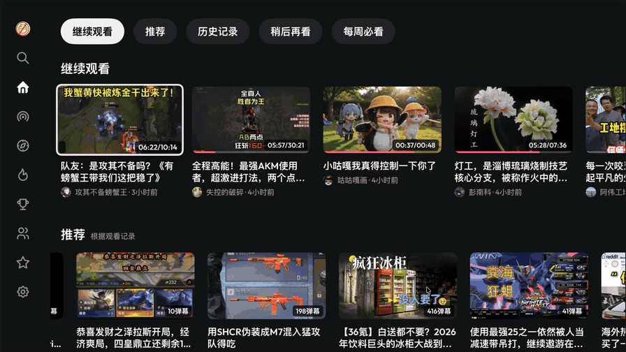
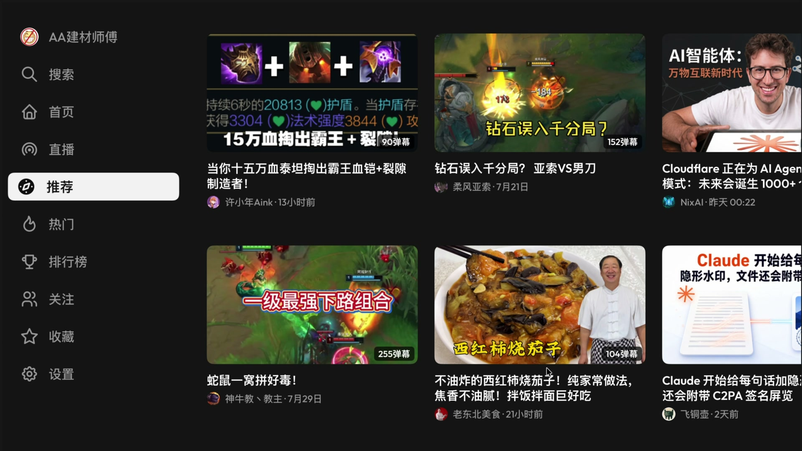
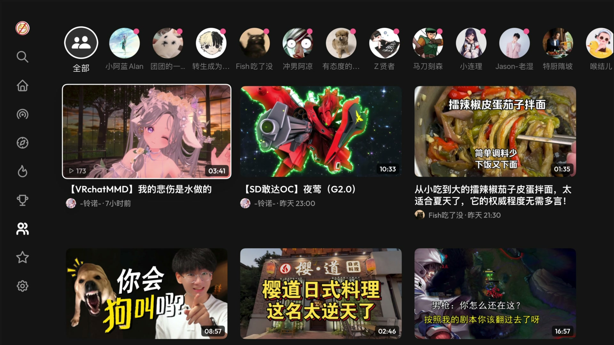
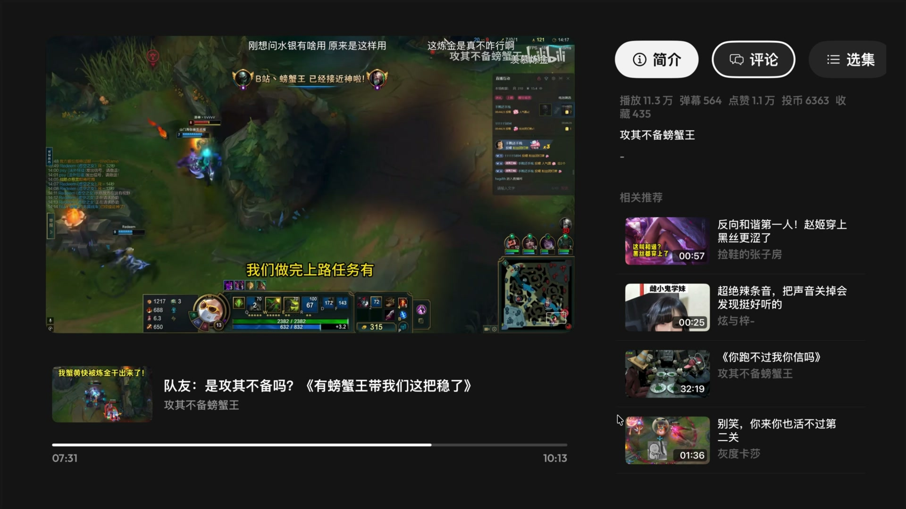
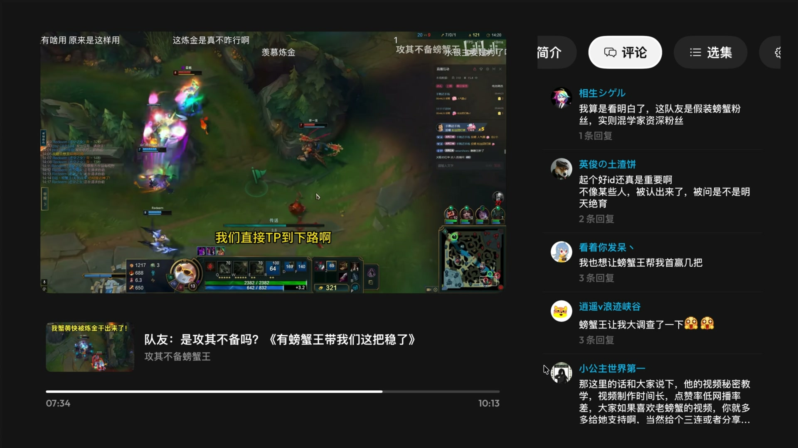
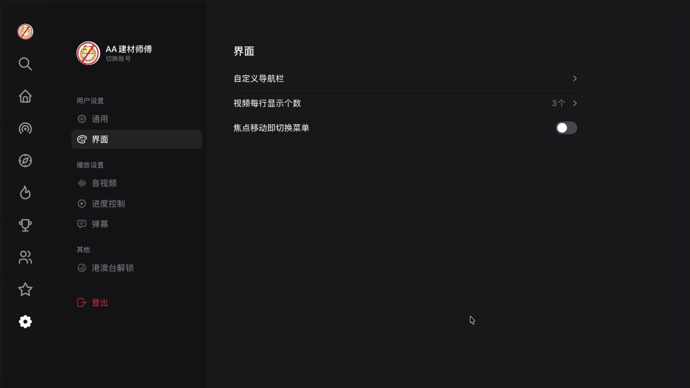
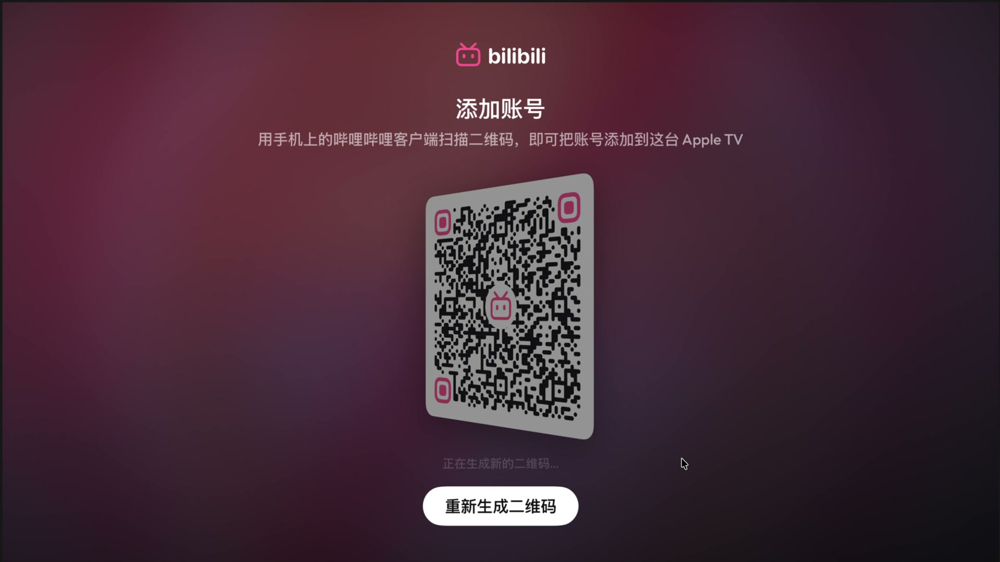

# BiliBili tvOS 客户端 Demo

### 本项目没有任何授权的 Testflight 发放以及任何收费版本，请注意辨别和考虑安全性问题。

 **BiliBili tvOS 客户端 Demo 从未在任何平台上架和收费（包括AppStore与Testflight）**

 如果您在任何平台上看到有人以收费方式提供本项目的服务或应用，请注意这是**未经授权的**行为，并且与我们的原始意图不符。我们强烈谴责将本项目用于商业盈利的行为，由此引发的任何安全风险与此项目无关。

---

## About this fork

A personal hobby project built on [yichengchen/ATV-Bilibili-demo](https://github.com/yichengchen/ATV-Bilibili-demo), reworking the UI from the ground up. Not affiliated with the original project or with BiliBili, and never distributed commercially — the original disclaimer above applies here in full.

*↑ 点击预览可观看完整视频 / click the preview for the full-quality video*

### What changed

- **Fully programmatic UI** on a shared design system — measured tokens, a custom icon set, and the Outfit display font replace the storyboard-era screens
- **Home rails** — a browsable home page with content rails and chip-bar filtering
- **Theater player** — an immersive playback container with related videos, comments and settings panes that never leave the video
- **SwiftUI settings** — a settings screen built on web-measured design tokens, with a morphing modal replacing system alerts across the app
- **Playback performance** — CDN host preference, throughput monitoring, segment prefetch and response caching

### Screenshots

<table>
  <tr>
    <td></td>
    <td></td>
  </tr>
  <tr>
    <td></td>
    <td></td>
  </tr>
  <tr>
    <td></td>
    <td></td>
  </tr>
</table>

---

*以下为原项目 README 内容 / original project README below.*

### 支持功能
- 二维码登录
- 云视听小电视投屏协议
- 直播与弹幕
- 推荐Feed
- 热门
- 排行榜
- 搜索
- 关注列表
- 历史播放
- 稍后再看
- 系统播放器播放视频
- 视频弹幕
- 热门评论
- 弹幕防挡
- 云视听投屏
- HDR播放
- 字幕

 
 
 

### Telegram Group
 - https://t.me/appletvbilibilidemo

### 未签名iPA文件

从 https://github.com/yichengchen/ATV-Bilibili-demo/releases/tag/nightly 获取基于最新代码构建的

### Links

- App Icon [【22娘×33娘】亲爱的UP主，你怎么还在咕咕咕？](https://www.bilibili.com/video/BV1AB4y1k7em)

- [thmatuza/MPEGDASHAVPlayerDemo](https://github.com/thmatuza/MPEGDASHAVPlayerDemo)

- [dreamCodeMan/B-webmask](https://github.com/dreamCodeMan/B-webmask)

- [分析Bilibili客户端的"哔哩必连"协议](https://xfangfang.github.io/028)
